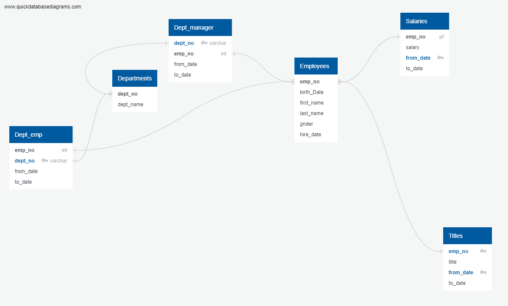

# Pewlett-Hackard-Analysis

## Overview
To help Pewlett Hackard better handle the large wave of retirees happening over the next few years, I have studied Employee data to identify which titles will have a large number of eligible retiries.  I have also put together a list of employees eligible for mentorship to help them transition and be paired off to help train others.

Both these analyses were powered by a SQL database that I created from various spreadsheets, containing an employee's info, salary, and title history.  To help navigate the data, I put together a diagram of the various entities.

## Number of Retirees by Title
I wanted to identify the job titles that would be most impacted by retirees leaving over the next few  years.

To conduct this analysis, I identified all retirement eligible employees based upon their birth date and their hire date.  From there, I pulled in their Employment Title history, with a focus on their most recent title.  Using their title history caused some duplication of data.

My summary findings are below.  Our largest needs are in the Senior Staff and Senior Engineer areas.  Promoting internal talent to senior roles and bringing in new Staff and Engineer talent should be our priority over the next few years to make sure we can manage this transition.  A file with all relevant employee names are available

## Establishing a mentorship program
As we transition, I wanted to identify candidates that would benefit from a mentorship program.  A mentorship program can help our candidates who are not yet retirement eligible and mentor them for senior opportunities or new challenges to help position them where Pewlett Hackard sees fit.

To conduct this analysis, I used my Employee Database to identify candidates what have a birth date in the the year 1965.  These are employees with experience, but they still have many years before eligibility for retirement.

I have included a file of all relevant mentorship candidates.  I have identified 1549 candidates.  This can be a start.  As we establish the program, we can fine tune the criteria for eligibility.
